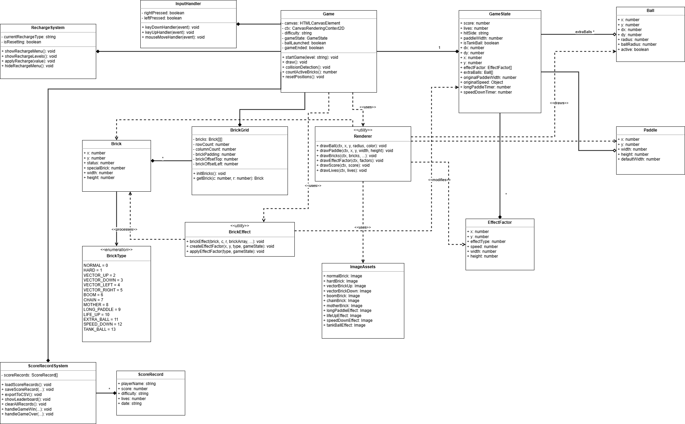

# “自制”打砖块游戏
大学生的课程设计项目，基于[项目](http://breakout.enclavegames.com/)，[原项目GitHub仓库](https://github.com/end3r/Gamedev-Canvas-workshop)。
小组成员：

---

## 1. 项目介绍
### 1.1 背景介绍
打砖块游戏，作为电子游戏史上最具代表性的经典作品之一，诞生于1976年。它以其简单的规则、即上手的操作和充满挑战性的玩法，风靡了全球数个世代的玩家。 打砖块游戏的核心玩法（移动挡板、反弹球体、消除目标）是游戏设计中最纯粹、最经得起时间考验的机制之一。本项目旨在回归游戏设计的本源，探索在极简规则下如何构建丰富、耐玩的游戏体验。通过对这样一个经典游戏的复刻，并加入自己的新元素、玩法。可以让我们更深刻的理解到本课程中学习到的开源软件开发精神。

### 1.2 系统架构
本项目主要使用Html嵌入Javascript代码实现，Html提供UI绘制，按钮交互以及排行榜存储功能；Javascript实现核心玩法。本游戏的UML图如下：

其中由一个主要的html文件控制游戏运行，html文件调用其他的js文件的函数使游戏正常运行。

---

## 2. 目标
### 2.1 更换原项目贴图
- 更换成Emoji图标

### 2.2 添加难度选择
根据难度改变球速以及板长度

### 2.3 按下⬆️键以开始
- 选择关卡结束后球在板子上，按下↑键发射球，开始游戏
- 板子没接住球时，球回到板子，按下↑键发射球

### 2.4 添加特殊砖块
#### 硬砖块：需要撞击两次才能破坏

#### 矢量砖块：需要从特定角度破坏

#### 炸弹砖块：击破后摧毁周围砖块

#### 连锁砖块：击破后摧毁一整列的砖块

#### 子母砖块：击破后在周围生成砖块

### 2.5 添加增益因子
添加特殊的增益减益因子：击打特定的砖块随机掉落增（减）益因子
#### 加长因子：加长板子一段时间，让玩家更容易接住小球

#### 生命因子：增加一点生命值

#### 增长因子：新发射一个小球

#### 穿透因子：小球获得力量，摧毁路径上的所有砖块

#### 减速因子：降低小球的移动速度一段时间

### 2.6 排行榜系统
- 游戏结束时可保存玩家名、剩余生命、游玩关卡、游戏时间
- 游玩结束时可查看排行榜，可以在游玩界面查看排行榜
- 成绩保存在浏览器缓存中，可导出成csv文件

### 2.7 设计新关卡

### 2.8 联机多人玩法
#### a.基本玩法
二人对战，分别操作位于界面上下边界的板子，显示同一个界面的对立视角，屏幕中间过一段时间出现特定砖块，一方破坏并拾取因子时使对方获得减益让对手无法将球击回，球从一方边界掉落时该方失去一点生命值，伴有神秘战败语音，改为对方发球，生命值掉到0后输掉对战。
#### b.添加多人对战中的增益因子
##### 对敌方deBuff
- 冰冻因子：减缓对方的小球移动速度
- java因子：在场上随机位置为对方添加砖块（添砖Java）
- 缩短因子：使对方的板子缩短

##### 对我方buff
- 加速因子：使我方小球加速

### 2.9 充值玩法
付费增加挡板长度或生命值

---

## 开发日志

1. 在最初版本中，由于碰撞函数的检测问题，出现了碰撞边界不对而导致的一次碰撞消除大量砖块的情况，于是优化了碰撞函数。

### Bug修复日志

#### - ~~变量名混乱~~
#### - ~~矢量方块应根据碰撞边判断~~
原：根据小球运动方向判断
#### - ~~硬砖块有时被击中一次就消失~~
#### - ~~矢量方块有时会把小球吸走~~

#### - ~~计分系统错误判断胜利条件~~
#### - ~~分数、生命显示超范围~~
#### - ~~没接住小球时应清空所有效果~~
#### - ~~增长因子带来的额外小球应基于砖块生成~~
原：根据小球位置生成
#### - ~~炸弹砖块和连锁砖块破坏特殊方块时，特殊效果不生效~~

#### - ~~充值系统板长度不保留~~
#### - ~~遇到矢量方块会卡死~~
添加充值按钮脱离卡死

#### - ~~最后一个方块被破坏时无法查看到被破坏的效果~~
添加延迟，更改胜利函数判断位置
#### - ~~充值系统故障~~

